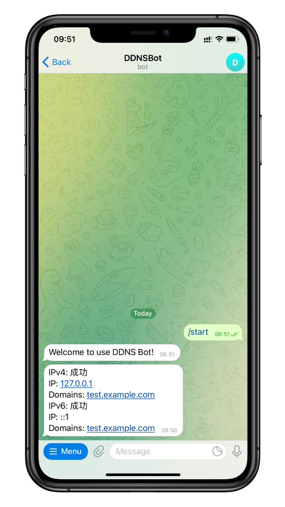

# ddns-telegram-bot


一个用于接收 [ddns-go](https://github.com/jeessy2/ddns-go) 通知的 Telegram 机器人



## 使用

1. 打开并启用 [@DDNSBot](https://t.me/KDDNS_bot)
2. 发送 `/gethook` 命令
3. 复制 Webhook URL 并粘贴
4. 复制 RequestBody 并粘贴
5. 可以使用`/ddns`查询域名当前解析的ipv4和ipv6地址

注：未启用 IPv4 或 IPv6 可删除对应 Object

```json
{
    "ipv4": {
        "result": "#{ipv4Result}",
        "addr": "#{ipv4Addr}",
        "domains": "#{ipv4Domains}"
    },
    "ipv6": {
        "result": "#{ipv6Result}",
        "addr": "#{ipv6Addr}",
        "domains": "#{ipv6Domains}"
    }
}

```

## 感谢

- [ddns-go](https://github.com/jeessy2/ddns-go)
- [telegram-bot-api](https://github.com/go-telegram-bot-api/telegram-bot-api)
- [DDNS-TELEGRAM-BOT搭建教程](https://github.com/wukibaka/ddns-telegram-bot/wiki/DDNS-TELEGRAM-BOT%E6%90%AD%E5%BB%BA%E6%95%99%E7%A8%8B)
